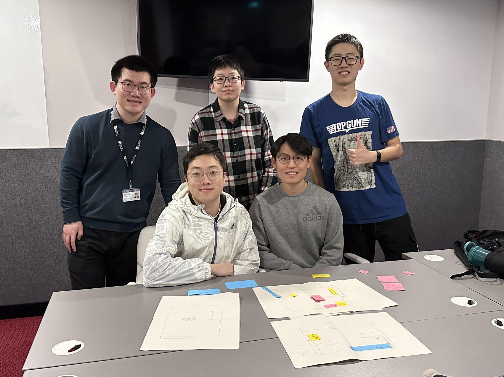
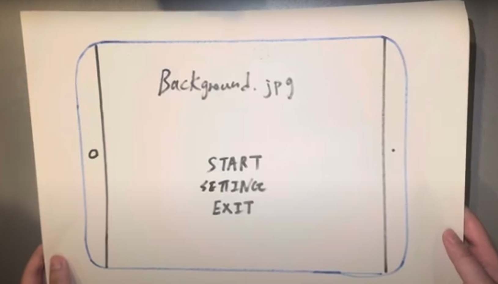
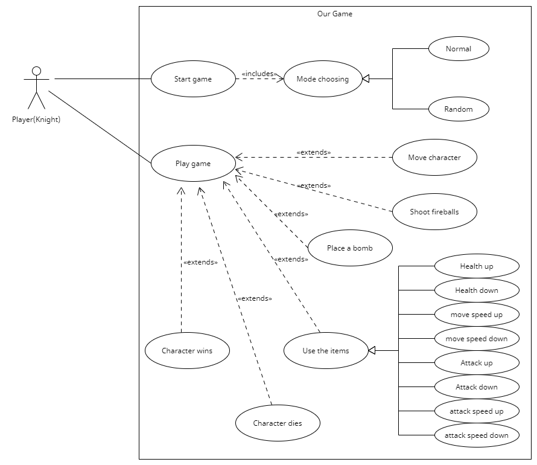
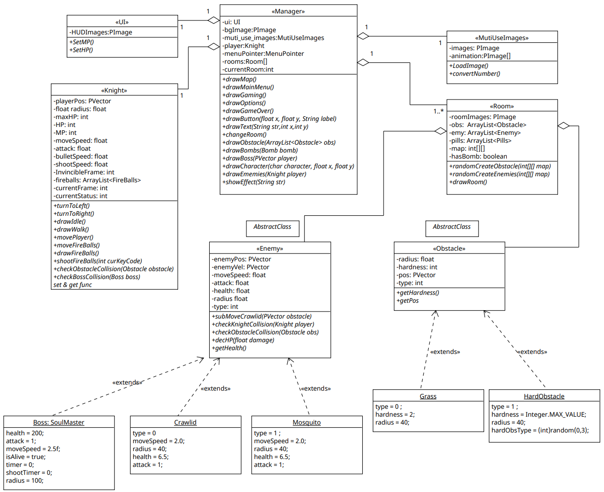
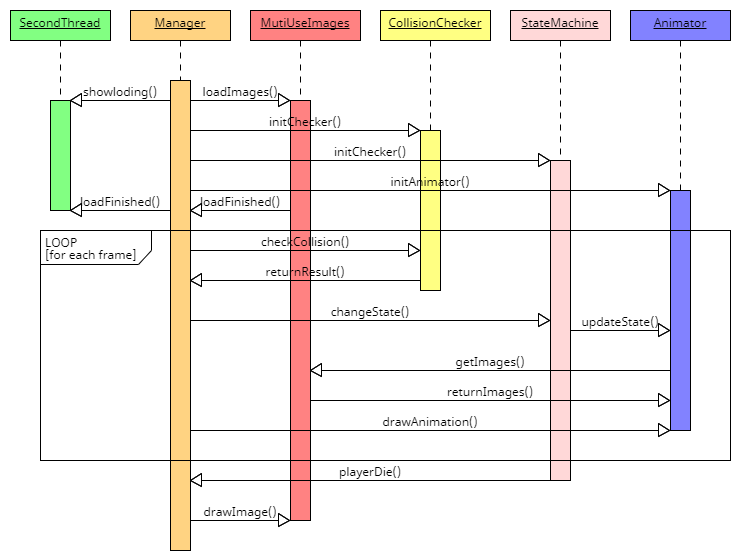
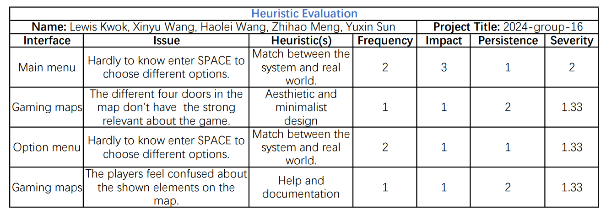
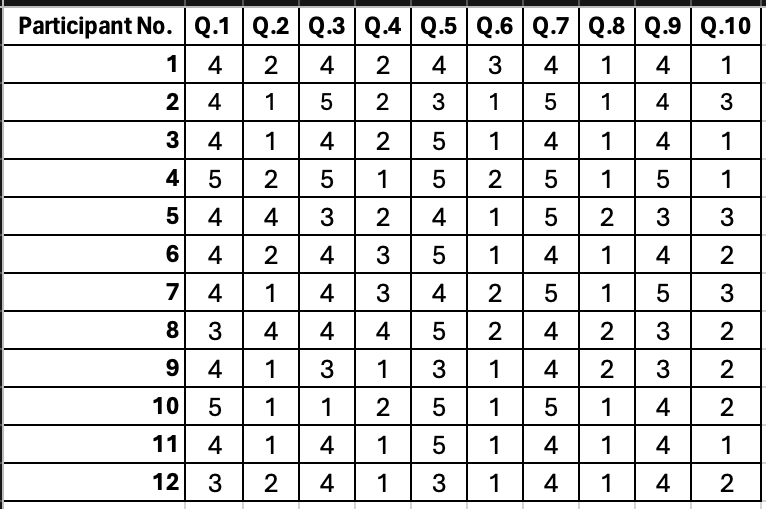
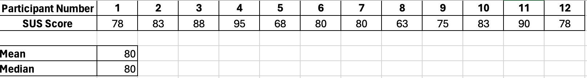
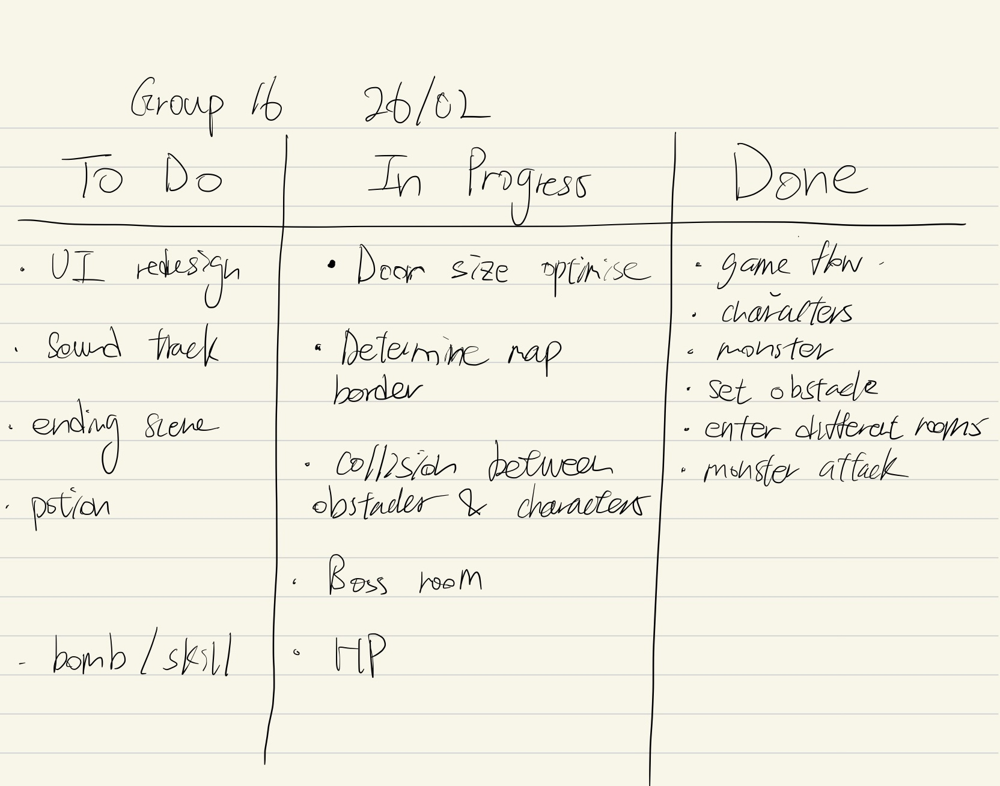

## ***Member list***

- Lewis Kwok, lewis.kwok.2023@bristol.ac.uk, lewiskyh

- Xinyu Wang, qn23459@bristol.ac.uk, whywxy7

- Haolei Wang, ac23993@bristol.ac.uk, haoleiw

- Zhihao Meng, vp23970@bristol.ac.uk, amengnew

- Yuxin Sun, vz23211@bristol.ac.uk, pblackcookie

### **members photo**

-----

# Introduction

Our game is based on Hollow Knight, a 2D platform adventure game in which the main character explores various areas and defeats bosses to gain special abilities. While the artwork might look familiar to those who have played Hollow Knight before, the experience of playing our game would be completely different. We removed the gravity system from the original game, so that the character could explore all areas of the visible map; we changed the original attacking mechanism for the main character to be able to attack enemies not in the nearest vicinity; and most crucially, we added rogue-like elements, e.g. random effects of artefacts picked up. The rogue-like parts of the game are inspired by another game called The Binding of Isaac, some of whose artwork we also incorporated in our game.

# Requirements

Deciding on two games was not too difficult. Many of our team members have played and enjoyed both Hollow Knight and The Binding of Isaac, so we were familiar with the game play of both. We then went on to produce paper prototype demos of games based on both.  

User story:  
- As a player, I want to be guided through how the game works.
- As a player, I want to see what the effects are after my character consumes an item.
-	As a player, I want to see how many artefacts I have in my inventory.
-	As a player, I want to see how much health I have left.
-	As a player, I want to challenge myself and try defeating boss-level enemies.  

We agreed that our final game should adhere to the above regardless of which game we end up going for. Picking one of the two, however, turned out to be nearly impossible. We eventually decided to combine elements of both games, using artwork mainly from Hollow Knight as they were readily available, and incorporated elements of game play from The Binding of Isaac.  

After deciding on what to work on, we first set out the use case specification of our game:  
1.	Systems displays main menu with start and setting buttons.
2.	User presses setting button.
3.	Systems displays options, including volume, language, font, mode, as well as copyright info and a reset button. System also provides options to modify default key presses.
4.	User presses esc to go back to the main menu.
5.	User presses start.
6.	Systems generates game data, including maps and in-game items. It displays prompts in the first room that instructs the user to operate the character with wasd, arrows etc.
7.	User presses buttons to control the character.
8.	System tracks user's key presses and modifies the game data accordingly.
9.	User completes the game.
10.	System displays "well done".

To keep in line with the game design of Hollow Knight, we want our game to be playable entirely via the keyboard, and as such have not included support for the mouse. We want the players to be able to control the movement of the main character using keys W, A, S and D, and attack enemies using the arrow keys, which we believe would be the most natural way to interact with a game. To add tension, we have modified the default behaviour of enemies in Hollow Knight – instead of being confined to a small area, they are now able to approach the main character and follow him wherever he goes in the room. We make sure the room above is always where the main character could obtain pills with random effects, so that the player always has the choice to take the risk of some uncertainty before facing the boss. That being said, rogue-like design is the most important principle for our game. So even if we provide players with the option to take the pills, we do not want to limit the game play to only one route. The player can freely choose which room he would like to visit first, whether he wants to take the pills. He can even go straight for the boss if he prefers!  

While we mainly used artworks from Hollow Knight, we did use the background of The Binding of Isaac in the first room the player finds himself in. This is because this image, very usefully, provides explanations of how the game could be played. This fits with one of our user stories, where we pointed out that a user should have some guidance on the game play.  

# Design

Before our team started actually writing code, we first came up with a class diagram as a guideline to our game. One team member was responsible for designing the top-level structure, while all members responsible for coding the game filled in the details – this was to ensure that our game has a consistent and unified design, both in the overall structure of the code as well as in other factors such as naming conventions.  

As the diagram presents, we have a class called Map which stores virtually all relevant states of the game. We initialise a Map object in the main function, and all our in-game objects are represented by sub-classes of Map. The sub-class UI, in particular, implements some of the aforementioned user stories that a user would like to see the current state the player is in.  

This section aims to be an overview of our design of the game – the next section goes into detail on the functionalities of the code. We would like to mention that, despite be generally complete, the diagrams presented in this section may not represent our game in its entirety. This is because our team adopted agile development methodologies. While coming up with diagrams was important in guiding our development sessions, we also found it incredibly valuable to sometimes come up with ideas spontaneously followed by immediate implementation without documenting them first. Despite one of the disadvantages of agile development being the lack of comprehensive documentation, we do believe this method allowed us to write our game efficiently.  

# Implementation

To keep the code modular, our first task, loading various in-game images, is achieved via using a MultiUseImage class. We recognise that some images, such as enemies, will be used multiple times, while others will only need to load once. Images which are to be used repeatedly are loaded in MultiUseImages, and other ones are loaded in their respective sections where they are needed. As per one of the principles stated, users should be able to see the system status. Hence we started a new thread in setup to load the images. This is to avoid the screen turning black while waiting for the processing, during which the user would be puzzled by the lack of visible system status.  

Since our game involves interacting with various objects, we need to implement functionalities to handle the collision of objects. Our fundamental approach is to represent each in-game character as a circle. As we know the centre and radii of the two objects, detecting whether two objects collide is a simple use of Pythagoras’ theorem: we compare the straight-line distance between two objects are see whether it’s less than the sum of their radii.  

Another aspect worth mentioning is the use of the Manager class. We created this class to keep track of all the in-game resources, such as background images and the UI. Keeping them in one place works well with our development context – since each of our coders are responsible for parts of the game, having a single object to combine all of the features implemented avoids clashes in the code.  

## Challenges

One of the main challenges we had was creating animation for the in-game characters. We did not want to just use still images to represent them; instead, we preferred having movements so that the game feels more immersive. After some discussions across the coders, we agreed on a single approach which we would apply to all characters: we would have multiple images of the same character which we would display one after another, and we would implement a built-in “timer” to keep track of which images to display at one particular time.  

This “timer” is realised using two attributes: currentFrame and currentStatus. Take the function drawIdle in Knight.pde as an example: we display the next image every 8 frames, having determined that this was an appropriate gap to leave between images so that the animation looks natural. Within this function we also constantly check which direction a character should be facing and flip the images accordingly.  

Another challenge we had was keeping track of the states of the characters, for which we essentially deployed a state machine. The function bossAction determines which action the boss is supposed to take depending on the actionCode, while functions such as drawIdle and drawWalk controls how the main character appears on screen depending on whether the player is moving him.  

We also wanted to implement an “invincible” state: after the knight collides with an enemy and loses health, there should be a short period of time during which the knight takes no damage, so that the player has time to react. This state is realised in the Manager class: we declared a variable called invinsibleFrame. At collision, if invinsibleFrame is zero, the knight takes damage and invinsibleFrame is reset to the initial value of 200, after which we begin a countdown during which the knight would take no further damage.  

We would also like to mention our handling of collisions. Our solution was to represent each entity as a circle, assigning it a centre and a radius. In the function checkObstacleCollision in Knight.pde, as an example, we compute the straight-line distance between the knight and the obstacle by calling the PVector.dist() function, after which checking whether the distance is smaller than the sum of the radii of the two objects would suffice.  

Another part to collision handling the actions to take upon collision. For enemies, the knight should lose health upon collision; for obstacles like grass, we would like to have the knight to bounce off in the opposite direction when he touches it. This functionality is handled in Manager.pde. Using the state machine mentioned above, we were able to keep track of which direction the knight is facing, and we could add movement in the opposite direction accordingly.  

# Evaluation

## Qualitative evaluation - Think Aloud and Heuristic Evaluations

We invited our course mates during the lab sessions to qualitatively evaluate our game in the development process. After the first-round evaluation, we had a quick meeting to discuss the issues that needed to be fixed. These helped us identify the areas of focus for us to improve our game.

### First round qualitative evaluations:

    Think Aloud Evaluation 1 on 11/3/2024:

    Positive comments: Beautiful design throughout the game.

    Negative comments: In the main and option menu, a bit lost which button to press to confirm. The character could not pass through the doors properly.

    Think Aloud Evaluation 2 on 11/3/2024:

    Positive comments: Fun to play.

    Negative comments: Didn’t know the difference between the 4 doors. Didn’t realise I went into a boss room. Had difficult passing through the doors in the game. 

Based on the results from the qualitative evaluations, the below areas needed to be improved:
 
•	Need a clear instruction on which button to use to confirm selection in menus.

•	Rework the code for the door dimensions.

•	Differentiate the boss door from other 3 doors. 

These three areas were mentioned a few times in both think aloud and heuristic evaluations. A particular concern was raised in relation to the confirm button in main and option menus. One observer gave a 3 score for impact and a 2 score for frequency of the issue. This suggested that these areas had an impact on user’s experience.

After the evaluation session, we had a quick group meeting to set out action plans to fix the issues.  In response to the first area of improvement, a clear instruction on which button to press needed to be displayed in the main page so that users understand which button to press. Secondly, we set up a coding session to work on the code for door dimensions specifically. Lastly, we decided to use different door pictures to make the boss room distinguishable. 

### Second round qualitative evaluations: 

    Think Aloud Evaluation 1 on 8/4/2024:

    Positive comments: Challenging but fun game and amazing background music. Instructions are clearer. 

    Negative comments: The bomb on the ground did not look like a bomb.

    Think Aloud Evaluation 2 on 8/4/2024:

    Positive comments: Instructions are clearer. Can pass through the doors smoothly. 

    Negative comments: The health potion on the ground was just like an obstacle. 

In the second round qualitative evaluations, we did not receive negative feedback on control and game accessibility and received positive feedback on the clear instructions provided in the game. As compared the first round evaluations, the major concerns were fixed, therefore we received more feedback than the first round. The negative feedback received this time was mostly around the use of graphics. This was relatively easy to fix, and we decided to make our own game graphics.

## Quantitative evaluation: System Usability Scale

We conducted quantitative evaluation of our game before the easter break. We invited 12 users to complete the System Usability Scale questionnaire. Studies show that using SUS enables us to receive a fair assessment of the perceived usability of a system even with only 8-12users. Studies also suggest that non-native speakers may find the word “cumbersome” in the statement difficult to understand. We adopted the suggestion by Finstad to replace the word “cumbersome” with “awkward” in the questionnaire to accommodate non-native speakers. From the 12 samples, our game obtained an average SUS score of 80 and the median is also 80. A SUS score above a 68 is considered above average, the results suggest that respondents were satisfied with our game in terms of usability.

SUS paper: https://uxpajournal.org/sus-a-retrospective/

## Testing

We carried out Black Box Testing on our game during our development. We adopted a feature testing approach in testing our program. First, we decomposed our game into smaller function units. Then we identified the key features for each unit. Lastly, we specified test cases for the key features. Our test cases focused on boundary cases as errors are more likely to occur in them. We were able to identify errors where the character could not pass through the boss door and where the attack range of the character’s bullets was incorrect. These were boundary errors and were spotted by the black box testing. We then proceeded to changing the size metrics in the code, and then tested these features again.

# Process

Our team worked together to formulate the game design. During the development process, we split into two sub-teams to manage the development process. One sub-team was responsible for the programming part of the game, the other sub-team was responsible for managing the game resources and documentations. We found that splitting into 2 teams in fact made our program development more efficient because each sub-team could concentrate on our own domain of tasks, and sometimes there was synergy within the tasks. Also, we used the weekly lab sessions to catch up and ensured everyone was on the same page.

Throughout the whole project, we used iPad as our Kanban board to outline our tasks and to keep track of them. We found the Kanban boards very effective in managing our task pipelines as we could clearly see what was done and what was outstanding at a glance. Although iPad was very handy as Kanban boards, we found the document management a bit unorganised. We had only one iPad in our team, so sometimes we could not use iPad as our Kanban board  when having sub-team meetings. We ended up having both physical and electronic Kanban boards, which we found a bit messy. In the future, we will use the collaborate function in Microsoft Word and will store the Word file in the Teams shared folder. In terms of communication, we generally used Teams to communicate on things that could be quickly accomplished and to share useful references amongst ourselves. We met in the lab session every week and sometimes stayed behind after the lab to discuss on our project. Our team had a very high attendance in the labs, so we found it easy to stay connected. 

In the game development stage, we followed the standard Git workflow and used git branches to manage our development. The main branch contained the finished units of our game, while the test and option branches were for us to develop and to test new features. This approach helped us manage the version control and collaborate remotely. We used GIMP to edit game graphics that we found online. The software allowed us to make the background of the pictures transparent and to adjust the rotations of the pictures. So we were able to utilise the graphic resources in the way we wanted. In addition to existing game graphics, we also created our original game graphics –  a bomb and two different health potions using Procreate on iPadOS. It was to address suggestions raised in second round qualitative evaluations to improve the game visuals. To improve the overall game experience, we composed an original soundtrack for the game using Dorico. We are lucky to have a teammate who has a music background, so it did not take us too much time to make our own soundtrack. We found the game more immersive with the soundtrack. 

Although we worked in two sub-teams during the game development, we had catchup meetings regularly and worked on the game together. We had a one day sprint during reading week where both sub-teams worked on the game together. We found that working in the same room greatly boosted our productivity. For example, while the programming team was developing the game, the resource team worked on editing the game graphics based on the their requirements. We could easily ask each other questions to clarify anything unclear, and could make adjustments and changes in a short turnaround time. so the process went really well. The resource team was also able to use this chance to get instant feedback on the documentations they were working on. We made a really good progress on this sprint day, so we were able to concentrate on the assignment and tests for other units in the following week.

We used the weekly Monday lab sessions of this unit as our regular check-ins. As our team had high attendance, we found the lab sessions very helpful in keeping us connected. We updated each other on the progress, and planned what needed to be done for the week, ensuring we were all on the same page. Without the Monday lab sessions, we would not have been able to collaborate this successfully.  

# Conclusion

This project provided a great opportunity for us to use a variety of software development techniques. The project is not only about developing a game but also about delivering a project in an agile way. After developing the game idea, we used planning poker to estimate the effort so that we had an idea of how much time we would need to deliver the project. During the development process, we found the evaluation techniques introduced in the lectures very useful, as we could get feedback from users which in turn helped us improve our game. For example, we adjusted the size metrics of the doors, composed our own original soundtrack for the game and designed our own gaming graphics. These improvements were inspired by the user feedback. Developing the game in an agile way allowed us to respond to changes easily during the game development. 

For future projects, we will consider all teammates’ commitments and workload outside of the project when planning for the project delivery. This year we benefited from the postponed deadline of another assignment, giving us enough buffer time to concentrate on the game demo, report write up and in-class test, all of which happened in the last teaching week. If that assignment had not been postponed, we would have had a hectic and stressful time in the last teaching week. 

If we had a chance to develop the game further, we would consider expanding the map and adding more attack modes for both player and monsters. We would also like to design a storyline, illustrated through game graphics, to make the game even more engaging. 

# Individual contribution:

Xinyu Wang : 1

Zhihao Meng : 1

Yuxin Sun : 1

Haolei Wang : 1

Lewis Kwok : 1

