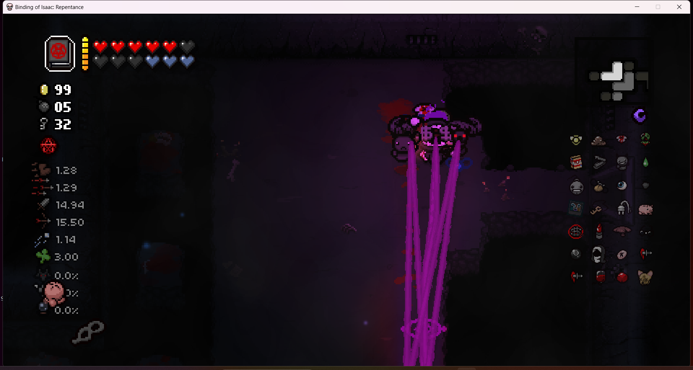

## ***Member list***

- Lewis Kwok, lewis.kwok.2023@bristol.ac.uk, lewiskyh

- Xinyu Wang, qn23459@bristol.ac.uk, whywxy7

- Haolei Wang, ac23993@bristol.ac.uk, haoleiw

- Zhihao Meng, vp23970@bristol.ac.uk, amengnew

- Yuxin Sun, vz23211@bristol.ac.uk, pblackcookie

### **members photo**

-----
 
# GAME IDEAS

## ***Idea 1***

### **The Binding of Isaac: Rebirth**

Classic ruguelike game with lots of random elements, use WASD to move up, down, left, right, and use the arrow keys to fire bullets (tears)!

Earn random drops or pedestal props by defeating bosses or clearing rooms.

A combination of multiple props may have an unexpected effect! (This is definitely the charm of the game!)

### Twist：

Some of the new props and resources, and the effects of combining them with other items (might need an update to the underlying logic?).

### Challenges:
    
    1.Map generation: Need to make sure the map makes sense while random elements are added.

    2.Enemy behaviour: Ensure the enemy's aggressiveness or behavioural coherence.

    3.Combination of multiple props.
----

## ***Idea 2***

### **Hollow Knight**

Horizontal Crossing Game with gravity. Fixed map and enemies, defeat enemies by attack or skill. Main character has more movement, turning left and right, attacking, jumping (two jumps), skills (maybe?), etc.

### Twist：

expect brand new skills and boss?

### Challenges:
    
    1.Map design: need to focus on interaction with the protagonist.

    2.Enemy behaviour: some actions which follow a certain logic.

    3.Character movement articulation: including attack, skill, hit and hostile character effects.
---

# Final Idea 

## Game1 name 

Click on the image below to jump to the video of paper prototype.

## Game2 name

Click on the image below to jump to the video of paper prototype.

# Requirements

## Stakeholders

1. Players
2. Markers
3. Game platform

## User Case Specification

1. Systems displays main menu with start and setting buttons
2. User presses setting button
3. Systems displays options, including volume, language, font, mode, as well as copyright info and a
   reset button. System also provides options to modify default key presses.
4. User presses esc to go back to the main menu
5. User presses start
6. Systems generates game data, including maps and in-game items. It displays prompts in the first
   room that instructs the user to operate the character with wasd, arrows etc.
7. User presses buttons to control the character
8. System tracks user's key presses and modifies the game data accordingly

9. User completes the game.
10. System displays "well done"

alternative flow:
9. User defeated
10. System displays "you're dead"
