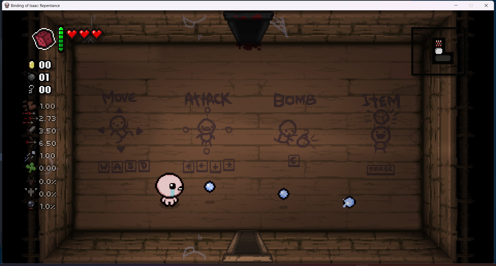

## ***Member list***

- Lewis Kwok, lewis.kwok.2023@bristol.ac.uk, lewiskyh

- Xinyu Wang, qn23459@bristol.ac.uk, whywxy7

- Haolei Wang, ac23993@bristol.ac.uk, haoleiw

- Zhihao Meng, vp23970@bristol.ac.uk, amengnew

- Yuxin Sun, vz23211@bristol.ac.uk, pblackcookie

### **members photo**

-----
 
# GAME IDEAS

## ***Idea 1***

### **The Binding of Isaac: Rebirth**

Classic ruguelike game with lots of random elements, use WASD to move up, down, left, right, and use the arrow keys to fire bullets (tears)!

Earn random drops or pedestal props by defeating bosses or clearing rooms.

A combination of multiple props may have an unexpected effect! (This is definitely the charm of the game!)

### Twist：

Some of the new props and resources, and the effects of combining them with other items (might need an update to the underlying logic?).

### Challenges:
    
    1.Map generation: Need to make sure the map makes sense while random elements are added.

    2.Enemy behaviour: Ensure the enemy's aggressiveness or behavioural coherence.

    3.Combination of multiple props.
----

## ***Idea 2***

### **Hollow Knight**

Horizontal Crossing Game with gravity. Fixed map and enemies, defeat enemies by attack or skill. Main character has more movement, turning left and right, attacking, jumping (two jumps), skills (maybe?), etc.

### Twist：

expect brand new skills and boss?

### Challenges:
    
    1.Map design: need to focus on interaction with the protagonist.

    2.Enemy behaviour: some actions which follow a certain logic.

    3.Character movement articulation: including attack, skill, hit and hostile character effects.
---

# Final Idea 

## Game1 name 

Click on the image below to jump to the video of paper prototype.

## Game2 name

Click on the image below to jump to the video of paper prototype.

# Requirements

## Stakeholders

1. Players
2. Markers
3. Game platform

## User Case Specification

1. Systems displays main menu with start and setting buttons
2. User presses setting button
3. Systems displays options, including volume, language, font, mode, as well as copyright info and a
   reset button. System also provides options to modify default key presses.
4. User presses esc to go back to the main menu
5. User presses start
6. Systems generates game data, including maps and in-game items. It displays prompts in the first
   room that instructs the user to operate the character with wasd, arrows etc.
7. User presses buttons to control the character
8. System tracks user's key presses and modifies the game data accordingly
9. User completes the game.
10. System displays "well done"

alternative flow:

9. User defeated  
10. System displays "you're dead"
    
## Class diagram

# Evaluation

## Qualitative evaluation - Think Aloud and Heuristic Evaluations

We invited our course mates during the lab sessions to qualitatively evaluate our game in the development process. After the first-round evaluation, we had a quick meeting to discuss the issues that needed to be fixed. These helped us identify the areas of focus for us to improve our game.

### First round qualitative evaluations:

    Think Aloud Evaluation 1 on 11/3/2024:

    Positive comments: Beautiful design throughout the game.

    Negative comments: In the main and option menu, a bit lost which button to press to confirm. The character could not pass through the doors properly.

    Think Aloud Evaluation 2 on 11/3/2024:

    Positive comments: Fun to play.

    Negative comments: Didn’t know the difference between the 4 doors. Didn’t realise I went into a boss room. Had difficult passing through the doors in the game. 

Based on the results from the qualitative evaluations, the below areas needed to be improved:
 
•	Need a clear instruction on which button to use to confirm selection in menus.

•	Rework the code for the door dimensions.

•	Differentiate the boss door from other 3 doors. 

These three areas were mentioned a few times in both think aloud and heuristic evaluations. A particular concern was raised in relation to the confirm button in main and option menus. One observer gave a 3 score for impact and a 2 score for frequency of the issue. This suggested that these areas had an impact on user’s experience.

After the evaluation session, we had a quick group meeting to set out action plans to fix the issues.  In response to the first area of improvement, a clear instruction on which button to press needed to be displayed in the main page so that users understand which button to press. Secondly, we set up a coding session to work on the code for door dimensions specifically. Lastly, we decided to use different door pictures to make the boss room distinguishable. 

### Second round qualitative evaluations: 

    Think Aloud Evaluation 1 on 8/4/2024:

    Positive comments: Challenging but fun game and amazing background music. Instructions are clearer. 

    Negative comments: The bomb on the ground did not look like a bomb.

    Think Aloud Evaluation 2 on 8/4/2024:

    Positive comments: Instructions are clearer. Can pass through the doors smoothly. 

    Negative comments: The health potion on the ground was just like an obstacle. 

In the second round qualitative evaluations, we did not receive negative feedback on control and game accessibility and received positive feedback on the clear instructions provided in the game. As compared the first round evaluations, the major concerns were fixed, therefore we received more feedback than the first round. The negative feedback received this time was mostly around the use of graphics. This was relatively easy to fix, and we decided to make our own game graphics.

## Quantitative evaluation: System Usability Scale

We conducted quantitative evaluation of our game before the easter break. We invited 12 users to complete the System Usability Scale questionnaire. Studies show that using SUS enables us to receive a fair assessment of the perceived usability of a system even with only 8-12users. Studies also suggest that non-native speakers may find the word “cumbersome” in the statement difficult to understand. We adopted the suggestion by Finstad to replace the word “cumbersome” with “awkward” in the questionnaire to accommodate non-native speakers. From the 12 samples, our game obtained an average SUS score of 80 and the median is also 80. A SUS score above a 68 is considered above average, the results suggest that respondents were satisfied with our game in terms of usability.

SUS paper: https://uxpajournal.org/sus-a-retrospective/

## Testing

We carried out Black Box Testing on our game during our development. We adopted a feature testing approach in testing our program. First, we decomposed our game into smaller function units. Then we identified the key features for each unit. Lastly, we specified test cases for the key features. Our test cases focused on boundary cases as errors are more likely to occur in them. We were able to identify errors where the character could not pass through the boss door and where the attack range of the character’s bullets was incorrect. These were boundary errors and were spotted by the black box testing. We then proceeded to changing the size metrics in the code, and then tested these features again.

# Process

Our team worked together to formulate the game design. During the development process, we split into two sub-teams to manage the development process. One sub-team was responsible for the programming part of the game, the other sub-team was responsible for managing the game resources and documentations. We found that splitting into 2 teams in fact made our program development more efficient because each sub-team could concentrate on our own domain of tasks, and sometimes there was synergy within the tasks. Also, we used the weekly lab sessions to catch up and ensured everyone was on the same page.

Throughout the whole project, we used iPad as our Kanban board to outline our tasks and to keep track of them. We found the Kanban boards very effective in managing our task pipelines as we could clearly see what was done and what was outstanding at a glance. Although iPad was very handy as Kanban boards, we found the document management a bit unorganised. We had only one iPad in our team, so sometimes we could not use iPad as our Kanban board  when having sub-team meetings. We ended up having both physical and electronic Kanban boards, which we found a bit messy. In the future, we will use the collaborate function in Microsoft Word and will store the Word file in the Teams shared folder. In terms of communication, we generally used Teams to communicate on things that could be quickly accomplished and to share useful references amongst ourselves. We met in the lab session every week and sometimes stayed behind after the lab to discuss on our project. Our team had a very high attendance in the labs, so we found it easy to stay connected. 

In the game development stage, we followed the standard Git workflow and used git branches to manage our development. The main branch contained the finished units of our game, while the test and option branches were for us to develop and to test new features. This approach helped us manage the version control and collaborate remotely. We used GIMP to edit game graphics that we found online. The software allowed us to make the background of the pictures transparent and to adjust the rotations of the pictures. So we were able to utilise the graphic resources in the way we wanted. In addition to existing game graphics, we also created our original game graphics –  a bomb and two different health potions using Procreate on iPadOS. It was to address suggestions raised in second round qualitative evaluations to improve the game visuals. To improve the overall game experience, we composed an original soundtrack for the game using Dorico. We are lucky to have a teammate who has a music background, so it did not take us too much time to make our own soundtrack. We found the game more immersive with the soundtrack. 

Although we worked in two sub-teams during the game development, we had catchup meetings regularly and worked on the game together. We had a one day sprint during reading week where both sub-teams worked on the game together. We found that working in the same room greatly boosted our productivity. For example, while the programming team was developing the game, the resource team worked on editing the game graphics based on the their requirements. We could easily ask each other questions to clarify anything unclear, and could make adjustments and changes in a short turnaround time. so the process went really well. The resource team was also able to use this chance to get instant feedback on the documentations they were working on. We made a really good progress on this sprint day, so we were able to concentrate on the assignment and tests for other units in the following week.

We used the weekly Monday lab sessions of this unit as our regular check-ins. As our team had high attendance, we found the lab sessions very helpful in keeping us connected. We updated each other on the progress, and planned what needed to be done for the week, ensuring we were all on the same page. Without the Monday lab sessions, we would not have been able to collaborate this successfully.  

